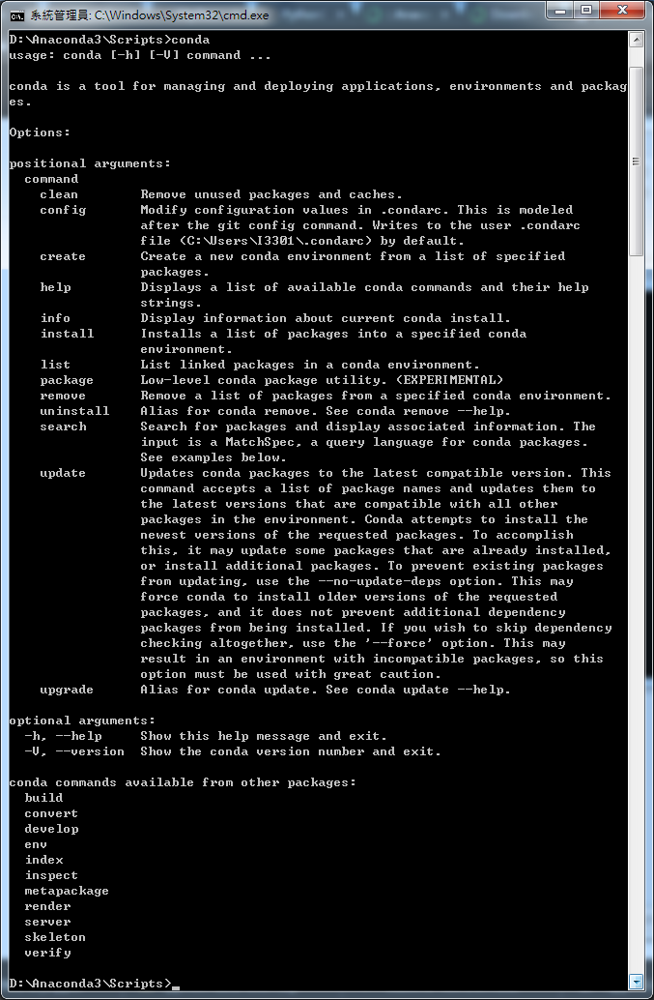
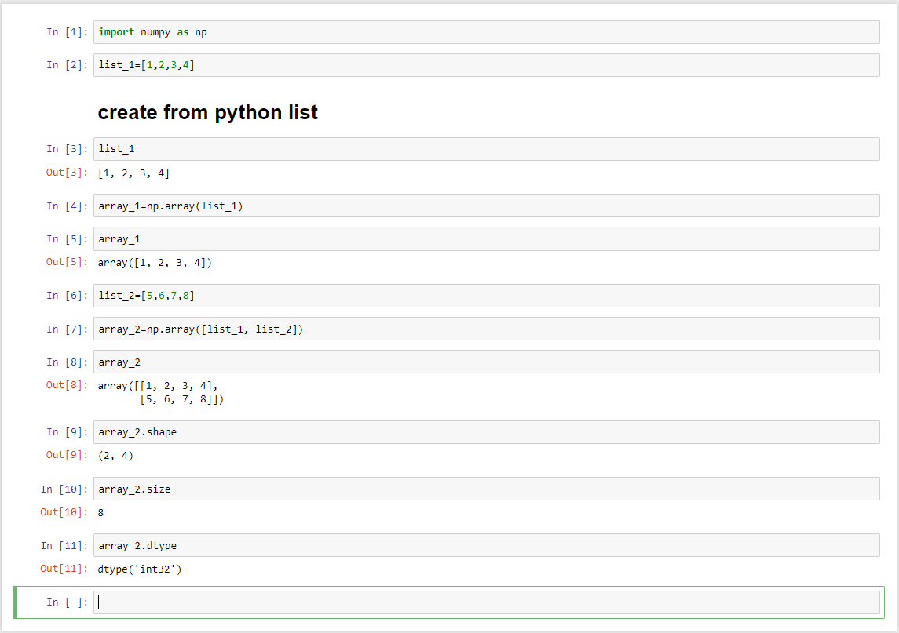
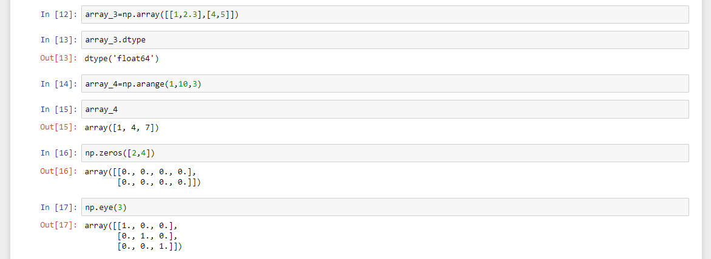
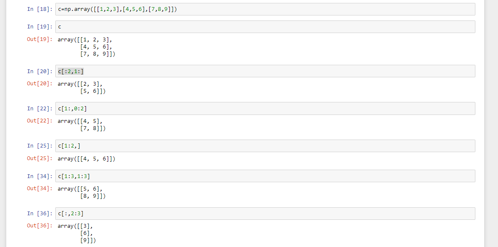
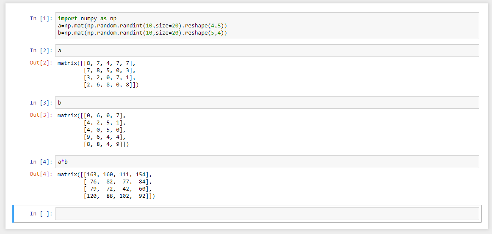
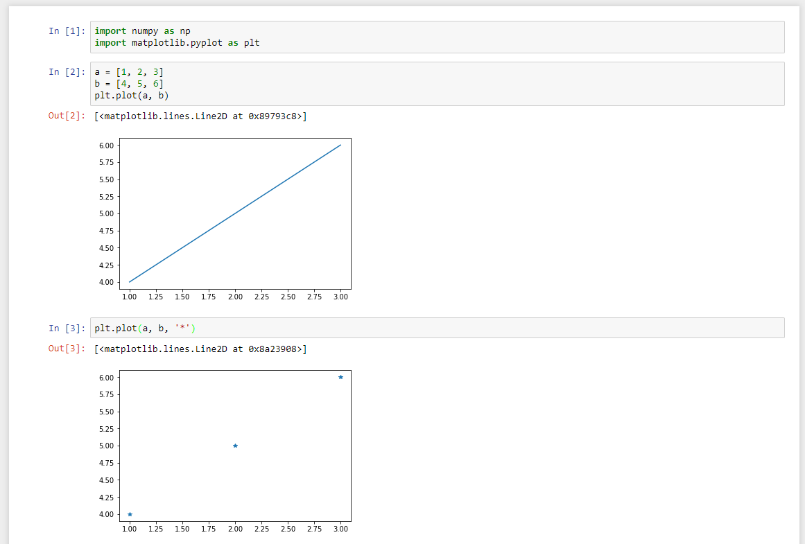
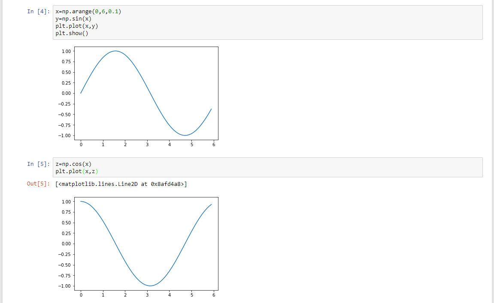
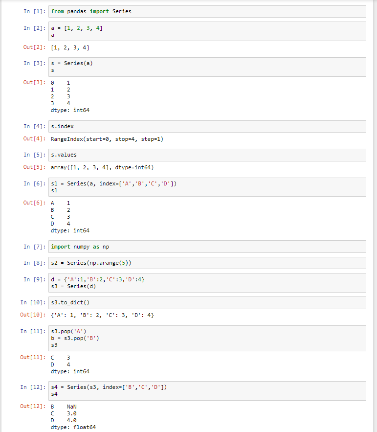
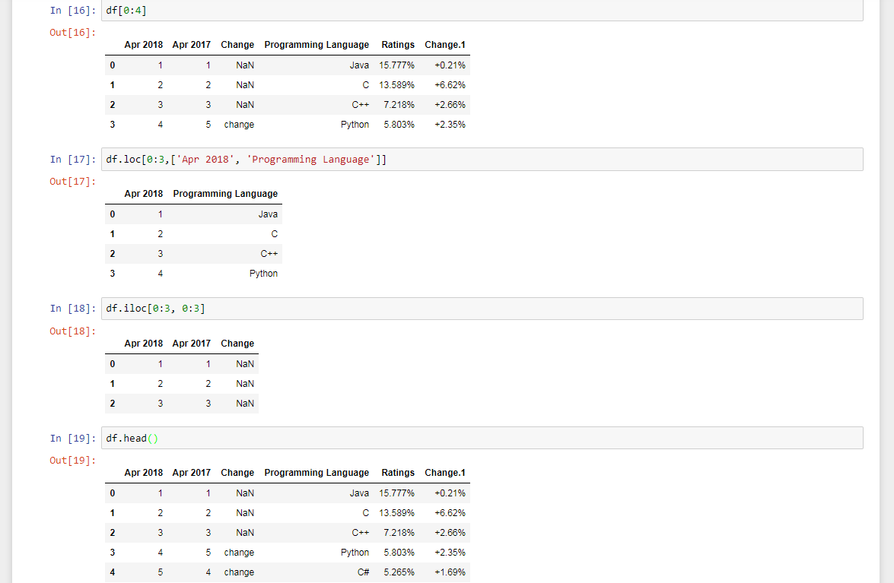
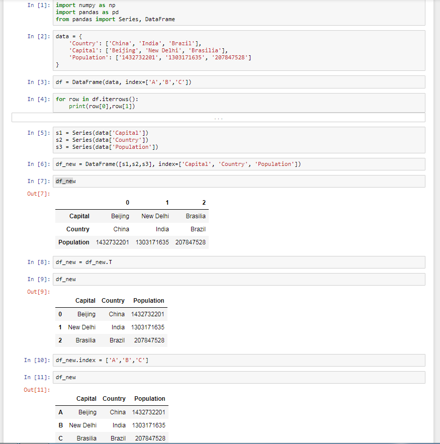

# PythonDataAnalysis

## jupyter
http://jupyter.org/install
```
start 
jupyter notebook

cmd cd Anaconda3\Scripts>
conda -V
conda list
ipython
```



### array
```
array.shape
array.size
array.dtype
numpy.arange(初始值,最大值,選項-間隔值)
numpy.zeros([列,行])
numpy.eye(單位矩陣)
```




### matrix
```
## mat矩陣
a=numpy.mat(np.random.randint(亂數最大值,size=陣列長度).reshape(列,行))
b=numpy.mat(np.random.randint(亂數最大值,size=陣列長度).reshape(列,行))
a*b
```


### matplotlib
https://matplotlib.org/
```
import numpy as np
import matplotlib.pyplot as plt
a = [1, 2, 3]
b = [4, 5, 6]
plt.plot(a, b)
plt.plot(a, b, '*')
```

```
import numpy as np
import matplotlib.pyplot as plt
x=np.arange(0,6,0.1)
y=np.sin(x)
plt.plot(x,y)
z=np.cos(x)
plt.plot(x,z)
```


### pandas
https://pandas.pydata.org/pandas-docs/stable/generated/pandas.Series.html
```
from pandas import Series
a = [1, 2, 3, 4]
s = Series(a)
s.index
s.values
s1 = Series(a, index=['A','B','C','D'])
import numpy as np
s2 = Series(np.arange(5))
d = {'A':1,'B':2,'C':3,'D':4}
s3 = Series(d)
s3.to_dict()
s3.pop('A')
b = s3.pop('B')
s4 = Series(s3, index=['B','C','D'])
s4.isnull()
s4.notnull()
```


```
import numpy as np
import pandas as pd
from pandas import Series,DataFrame
link = 'https://www.tiobe.com/tiobe-index/'
import webbrowser
webbrowser.open(link)
df = pd.read_clipboard()
###df = pd.read_clipboard() 需將網頁中表格複製###
df
df.Ratings
df['Programming Language']
df.columns
df.index
df_new = DataFrame(df, columns=['Programming Language','Apr 2018'])
df_new = DataFrame(df, columns=['Programming Language','Apr 2017','Apr 2018'])
df_new['Oct 2018'] = range(0,10)
df_new = DataFrame(df, columns=['Programming Language','Oct 2017','Oct 2018'])
df_new['Oct 2018'] = Series([100,200], index=[2,3])
df[0:4]
###0-3###
df.loc[0:3,['Oct 2016', 'Programming Language']]
###0-4###
df.iloc[0:3, 0:3]
###0-3:0-3###
df.head()
###前幾筆###
df.tail()
###後幾筆###
```

```
import numpy as np
import pandas as pd
from pandas import Series, DataFrame
data = {
    'Country': ['China', 'India', 'Brazil'],
    'Capital': ['Beijing', 'New Delhi', 'Brasilia'],
    'Population': ['1432732201', '1303171635', '207847528']
}
df = DataFrame(data, index=['A','B','C'])
for row in df.iterrows():
    print(row[0],row[1])
###iterrows逐列取出###
s1 = Series(data['Capital'])
s2 = Series(data['Country'])
s3 = Series(data['Population'])
df_new = DataFrame([s1,s2,s3], index=['Capital', 'Country', 'Population'])
df_new = df_new.T
###行列轉換###
```

