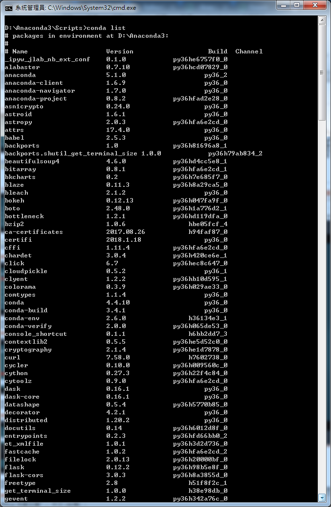

# PythonDataAnalysis

## jupyter
```
start 
jupyter notebook

cmd cd Anaconda3\Scripts>
conda -V
conda list
ipython
```


### array
```
array.shape
array.size
array.dtype
numpy.arange(初始值,最大值,選項-間隔值)
numpy.zeros([列,行])
numpy.eye(單位矩陣)
```


### matrix
```
## mat矩陣
a=numpy.mat(np.random.randint(亂數最大值,size=陣列長度).reshape(列,行))
b=numpy.mat(np.random.randint(亂數最大值,size=陣列長度).reshape(列,行))
a*b
```


